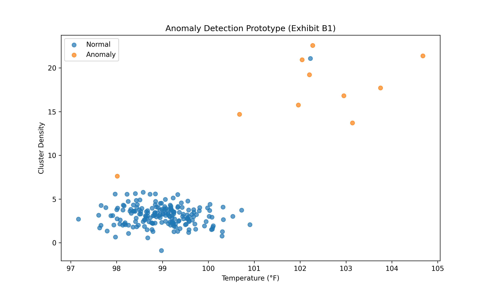
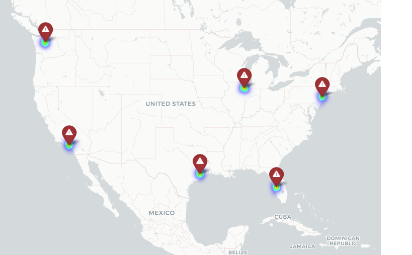

# Machine Learning-Based Epidemiological Surveillance Framework

## Project Overview
This repository contains the technical implementation and prototype for a next-generation epidemiological surveillance system. The project leverages unsupervised machine learning (ML) and geospatial analytics to enhance the early detection of emerging public health threats.

This framework is a core component of my **Proposed Endeavor**, designed to strengthen the United States' public health infrastructure by providing an adaptive, data-driven layer for outbreak monitoring.

## Technical Architecture
[cite_start]The system follows a structured, multi-stage architecture that transforms raw healthcare data into actionable epidemiological intelligence[cite: 5, 6]:
1. [cite_start]**Data Ingestion:** Receives and validates structured healthcare data (e.g., JSON-based reports)[cite: 8].
2. [cite_start]**Feature Engineering:** Transforms quantitative indicators like temperature and symptom density into analytical features[cite: 10, 11].
3. [cite_start]**Anomaly Detection:** Applies the `Isolation Forest` algorithm to identify statistically significant deviations from baseline patterns[cite: 12, 13].
4. [cite_start]**Geospatial Analysis:** Uses Kernel Density Estimation (KDE) and spatial autocorrelation (Moran’s I) to confirm high-risk clusters[cite: 14, 15].
5. [cite_start]**Visualization:** Generates intuitive risk maps to support targeted public health interventions[cite: 16].

## Key Visualizations

### 1. Anomaly Detection Results (Figure B1)
[cite_start]This plot illustrates the model's ability to distinguish between typical seasonal patterns (Normal) and potential outbreak signals (Anomalies) based on temperature and cluster density[cite: 21, 23].

[cite_start]*Note: Minor overlaps between classes highlight the necessity of expert calibration and biostatistical supervision to minimize false positives in real-world settings[cite: 25, 26].*

### 2. Geospatial Risk Map (Figure B2)
[cite_start]This heatmap demonstrates how detected signals are translated into actionable geospatial intelligence for resource targeting[cite: 30, 32].


## Technologies & Tools
[cite_start]The prototype is implemented using industry-standard Python libraries, ensuring scalability and real-world applicability within existing healthcare infrastructures[cite: 54, 60]:
- [cite_start]**Language:** Python [cite: 55]
- [cite_start]**Data Handling:** pandas, NumPy [cite: 56, 57]
- [cite_start]**Machine Learning:** scikit-learn (Isolation Forest) [cite: 58]
- [cite_start]**Visualization:** Matplotlib, Folium [cite: 59]

## How to Run
1. **Install Dependencies:**
   ```bash
   pip install -r requirements.txt
